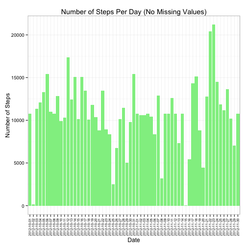

### Loading the activity data 


1. Loading the file "activity.csv" from the current working directory


```r
activity <- read.csv("activity.csv", header = TRUE)
```

### Mean total number of steps taken per day
*The missing values (NA) are ignored.*

1. Histogram of the total number of steps taken each day

```r
total.steps.per.day <- aggregate(steps ~ date, activity, sum)
library(ggplot2)
h <- ggplot(total.steps.per.day, aes(date, steps)) +
  geom_bar(stat = "identity", fill = "lightblue") +
  labs(x = "Date", y = "Number of Steps", title = "Number of Steps Per Day") 
theme_new <- theme_set(theme_bw())
theme_new <- theme_update(axis.text.x = element_text(angle = 90, size = 7))
h
```

 

2. Mean and Median total number of steps taken per day


```r
mean.total.steps.per.day <- mean(total.steps.per.day$steps)
median.total.steps.per.day <- median(total.steps.per.day$steps)
```
- The Mean of the total number of steps taken per day is **10,766.19**
- The Median of the total number of steps taken per day is **10,765**

### Daily activity pattern
1. Time series average number of steps taken by 5 minutes, and averaged across all days


```r
activity$interval <- as.factor(activity$interval)
average.steps.by.5min <- aggregate(steps ~ interval, activity, mean)
l <- ggplot(average.steps.by.5min, aes(interval, steps)) + 
  geom_line(aes(group=1)) +
  geom_hline(yintercept = mean(activity[is.na(activity$steps)==FALSE,]$steps), color = "red") +
  scale_x_discrete(breaks = seq(0,2355,by=30))
l
```

 

2. Period with highest average

```r
highest.5min.average <- head(average.steps.by.5min[order(-average.steps.by.5min$steps),], 1)
```
- The 5-minute interval, on average across all the days in the dataset which contains the maximum number of steps is the minute **835** with an average of 206.1698 steps.

### Imputing missing values
1. The total number of missing values in the dataset

```r
activity.missing.values <- activity[is.na(activity$steps),]
number.missing.values <- nrow(activity.missing.values)
```
- The number of missing values is **2304**.
2. Filling missing values with mean of the corresponding 5 minutes interval

```r
getImputedSteps <- function(interval){
  steps <- average.steps.by.5min[average.steps.by.5min$interval == interval,]$steps
  steps
}
activity$imputed.steps <- sapply(activity$interval,function(x){getImputedSteps(x)})
activity[(is.na(activity$steps)==FALSE),]$imputed.steps <- activity[(is.na(activity$steps)==FALSE),]$steps
```
3. New dataset with missing values filled

```r
activity.no.missing <- activity[c("imputed.steps", "date", "interval")]
names(activity.no.missing)[1] <- "steps"
summary(activity.no.missing)
```

```
##      steps                date          interval    
##  Min.   :  0.00   2012-10-01:  288   0      :   61  
##  1st Qu.:  0.00   2012-10-02:  288   5      :   61  
##  Median :  0.00   2012-10-03:  288   10     :   61  
##  Mean   : 37.38   2012-10-04:  288   15     :   61  
##  3rd Qu.: 27.00   2012-10-05:  288   20     :   61  
##  Max.   :806.00   2012-10-06:  288   25     :   61  
##                   (Other)   :15840   (Other):17202
```
4. Histogram of the total number of steps taken each day

```r
total.steps.per.day.no.missing <- aggregate(steps ~ date, activity.no.missing, sum)
library(ggplot2)
h.no.missing <- ggplot(total.steps.per.day.no.missing, aes(date, steps)) +
  geom_bar(stat = "identity", fill = "lightgreen") +
  labs(x = "Date", y = "Number of Steps", title = "Number of Steps Per Day (No Missing Values)") 
theme_new <- theme_set(theme_bw())
theme_new <- theme_update(axis.text.x = element_text(angle = 90, size = 7))
h.no.missing
```

 

```r
mean.total.steps.per.day.no.missing <- mean(total.steps.per.day.no.missing$steps)
median.total.steps.per.day.no.missing <- median(total.steps.per.day.no.missing$steps)
```
- The Mean of the total number of steps taken per day is **10,766.19**
- The Median of the total number of steps taken per day is **10,766.19**

*The mean remains unchanged however, the median is now higher and equal to the mean the total number of steps is in turn higher.*

### Weekdays and Weekends activity pattern


